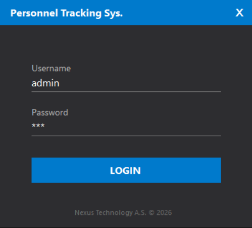
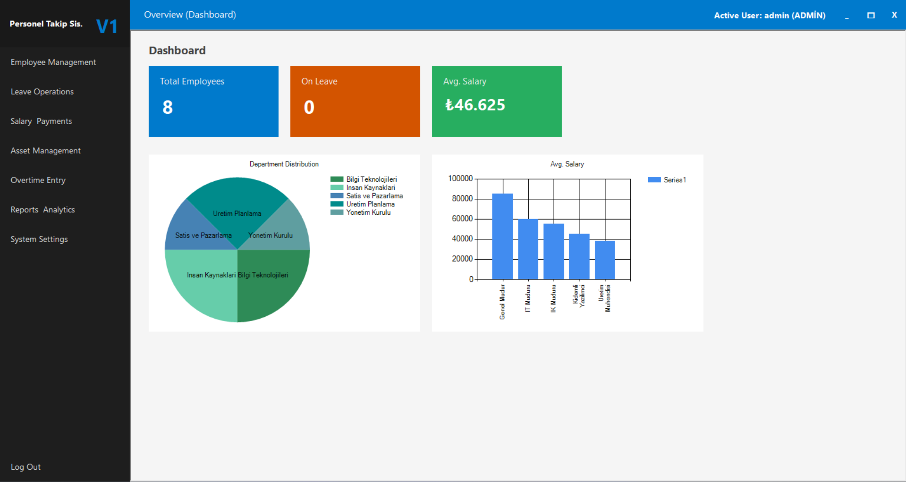
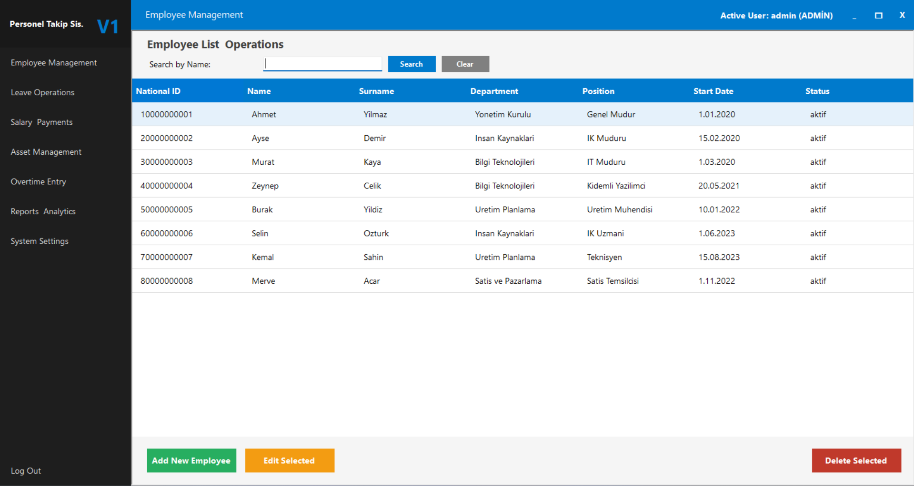
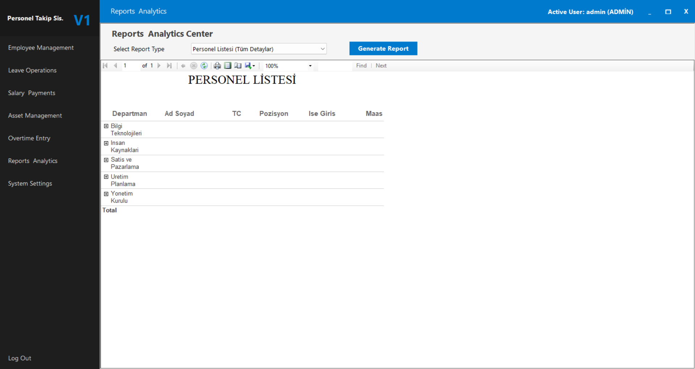

<div align="center">

  <h1>🏢 Personel Takip Sistemi (Enterprise Edition)</h1>
  
  <p>
    <strong>Modern, Güvenli ve Ölçeklenebilir İnsan Kaynakları Yönetim Platformu</strong>
  </p>

  <p>
    <a href="https://github.com/YusufToktas">
      
    </a>
    <a href="https://linkedin.com/in/yusuftoktas">
      
    </a>
  </p>

  <p>
    
    
    
    
    
    
  </p>

  <br />
  
  
  
  <p><em>(Programın çalışırken önizlemesi)</em></p>

</div>

---

## 📖 Proje Hakkında

**Personel Takip Sistemi**, kurumsal firmaların İK süreçlerini dijitalleştirmek için geliştirilmiş; **SOLID** prensiplerine sadık, **N-Tier** mimariye uygun ve **Generic Repository Pattern** kullanılarak tasarlanmış profesyonel bir masaüstü uygulamasıdır.

Sadece veri kaydetmekle kalmaz; personelin zimmetinden ek mesaisine, izin durumundan detaylı maaş bordrosuna kadar tüm yaşam döngüsünü yönetir. **Microsoft Report Viewer** ile detaylı dökümler sunar.

---

## ✨ Temel Özellikler

### 🏗️ Mimari & Teknoloji
* 🎨 **Modern UI:** Standart Windows formları yerine modern, çerçevesiz (borderless) ve kullanıcı dostu arayüz.
* 🌍 **Multi-Language (Çoklu Dil):** Veritabanı tabanlı, genişletilebilir dil altyapısı (TR/EN).
* 🔒 **Yüksek Güvenlik:** `AES-256` ile şifrelenmiş yerel ayar dosyaları ve `SHA-256` ile hashlenmiş parolalar.
* ⚙️ **Design Patterns:** Singleton & Generic Repository desenleri ile temiz kod (Clean Code).

### 🚀 Fonksiyonel Modüller
| Modül | Açıklama |
| :--- | :--- |
| **👥 Personel Yönetimi** | Resimli personel kartları, departman ve pozisyon atamaları. |
| **📅 İzin Sistemi** | Personel talep ve yönetici onay/red mekanizması. |
| **💰 Bordro & Maaş** | Prim, kesinti ve net maaş hesaplama motoru. |
| **💻 Zimmet Takibi** | Şirket demirbaşlarının personele atanması ve takibi. |
| **⏱️ Ek Mesai** | Fazla mesai saatlerinin girişi ve otomatik ücret hesabı. |
| **📊 Raporlama** | PDF/Excel formatında detaylı departman ve maliyet analizleri. |

---

## 📸 Ekran Görüntüleri

<div align="center">

| 🔐 Giriş Ekranı | 🏠 Dashboard (Ana Panel) |
| :---: | :---: |
|  |  |

| 👥 Personel Listesi | 📑 Raporlama Ekranı |
| :---: | :---: |
|  |  |

</div>

---

## 🛠️ Kurulum ve Çalıştırma

Projeyi yerel makinenizde çalıştırmak için aşağıdaki adımları izleyin.

### 1. Gereksinimler
* Visual Studio 2019/2022
* Microsoft SQL Server
* .NET Framework 4.7.2+

### 2. Veritabanı Kurulumu
Aşağıdaki SQL kodunu SSMS (SQL Server Management Studio) üzerinde çalıştırarak veritabanını ve örnek verileri oluşturun.

<details>
  <summary><strong>📥 SQL Scriptini Görüntüle (Tıkla ve Genişlet)</strong></summary>
  

  ```sql
create database personeltakipsistemidb;
use personeltakipsistemidb;

-- =============================================
-- MODUL 1: KURUMSAL ORGANIZASYON YAPISI
-- =============================================

-- sirketin subeleri (merkez, fabrika, bolge mudurlugu)
create table subeler (
    sube_id int identity(1,1) primary key,
    sube_adi nvarchar(100) not null,
    sehir nvarchar(50) not null,
    adres nvarchar(250) null,
    telefon nvarchar(20) null,
    yonetici_id int null -- sube muduru
);

-- departmanlar (bolumler)
create table departmanlar (
    departman_id int identity(1,1) primary key,
    sube_id int not null, -- departman hangi subede
    departman_adi nvarchar(100) not null,
    ust_departman_id int null, -- hiyerarsi icin (orn: yazilim -> ar-ge)
    masraf_kodu nvarchar(50) null, -- muhasebe entegrasyonu icin
    aciklama nvarchar(250) null,
    foreign key (sube_id) references subeler(sube_id)
);

-- unvanlar ve pozisyonlar
create table pozisyonlar (
    pozisyon_id int identity(1,1) primary key,
    departman_id int not null,
    pozisyon_adi nvarchar(100) not null,
    yetki_kodu int default 0, -- 1-10 arasi yetki seviyesi
    overtime_hakki_var_mi bit default 1, -- fazla mesai alabilir mi?
    foreign key (departman_id) references departmanlar(departman_id)
);

-- =============================================
-- MODUL 2: PERSONEL OZLUK VE AILE
-- =============================================

-- personeller (master tablo)
create table personeller (
    personel_id int identity(1,1) primary key,
    
    -- kimlik
    tc_kimlik_no nvarchar(11) not null unique,
    sicil_no nvarchar(20) not null unique,
    ad nvarchar(50) not null,
    soyad nvarchar(50) not null,
    uyruk nvarchar(50) default 'TC',
    cinsiyet nvarchar(10) null,
    dogum_tarihi date null,
    dogum_yeri nvarchar(50) null,
    kan_grubu nvarchar(10) null,
    medeni_hal nvarchar(20) null,
    
    -- iletisim
    email_sirket nvarchar(100) unique null,
    email_kisisel nvarchar(100) null,
    cep_telefonu nvarchar(20) not null,
    ev_telefonu nvarchar(20) null,
    ikametgah_adresi nvarchar(500) null,
    
    -- kurumsal
    sube_id int not null,
    departman_id int not null,
    pozisyon_id int not null,
    yonetici_id int null,
    ise_giris_tarihi date not null,
    sozlesme_turu nvarchar(50) default 'belirsiz_sureli',
    calisma_durumu nvarchar(50) default 'aktif', -- aktif, izinli, askida, ayrildi
    ayrilis_tarihi date null,
    ayrilis_nedeni nvarchar(250) null,
    
    -- finansal
    maas_tipi nvarchar(20) default 'net', -- net veya brut
    ucret decimal(18,2) default 0,
    banka_adi nvarchar(100) null,
    iban nvarchar(50) null,
    
    -- ozel durumlar
    engellilik_orani int default 0,
    hukumlu_mu bit default 0,
    teror_magduru_mu bit default 0,
    
    resim_yolu nvarchar(500) null,
    
    foreign key (sube_id) references subeler(sube_id),
    foreign key (departman_id) references departmanlar(departman_id),
    foreign key (pozisyon_id) references pozisyonlar(pozisyon_id)
);

-- aile bireyleri (agi ve yardimlar icin)
create table aile_bireyleri (
    aile_id int identity(1,1) primary key,
    personel_id int not null,
    yakinlik_derecesi nvarchar(50) not null, -- es, cocuk, anne
    ad_soyad nvarchar(100) not null,
    tc_kimlik_no nvarchar(11) null,
    dogum_tarihi date null,
    calisiyor_mu bit default 0, -- es yardimi icin onemli
    okuyor_mu bit default 0, -- cocuk yardimi icin onemli
    foreign key (personel_id) references personeller(personel_id)
);

-- kariyer gecmisi (terfi ve transferler)
create table kariyer_hareketleri (
    hareket_id int identity(1,1) primary key,
    personel_id int not null,
    tarih date not null,
    eski_departman_id int null,
    yeni_departman_id int not null,
    eski_pozisyon_id int null,
    yeni_pozisyon_id int not null,
    eski_maas decimal(18,2) null,
    yeni_maas decimal(18,2) null,
    aciklama nvarchar(250) null, -- terfi, tenzil, transfer
    foreign key (personel_id) references personeller(personel_id)
);

-- =============================================
-- MODUL 3: ZAMAN YONETIMI VE VARDIYA
-- =============================================

-- vardiya tanimlari
create table vardiya_tanimlari (
    vardiya_id int identity(1,1) primary key,
    vardiya_adi nvarchar(50) not null, -- 08-17, 16-24, gece
    baslangic_saati time not null,
    bitis_saati time not null,
    mola_suresi_dk int default 60,
    erken_mesai_carpan decimal(3,2) default 1.5,
    gece_zammi_var_mi bit default 0
);

-- personelin vardiya cizelgesi
create table personel_vardiyalari (
    atama_id int identity(1,1) primary key,
    personel_id int not null,
    vardiya_id int not null,
    baslangic_tarihi date not null,
    bitis_tarihi date null, -- null ise surekli bu vardiyada
    foreign key (personel_id) references personeller(personel_id),
    foreign key (vardiya_id) references vardiya_tanimlari(vardiya_id)
);

-- pdks verileri (kart okuma)
create table pdks_hareketleri (
    hareket_id bigint identity(1,1) primary key,
    personel_id int not null,
    zaman_damgasi datetime default getdate(),
    hareket_tipi nvarchar(10) not null, -- giris, cikis, mola_cikis, mola_donus
    terminal_kodu nvarchar(50) null,
    foreign key (personel_id) references personeller(personel_id)
);

-- =============================================
-- MODUL 4: FINANS, MAAS VE IZIN
-- =============================================

-- izin turleri
create table izin_turleri (
    tur_id int identity(1,1) primary key,
    tur_adi nvarchar(50) not null,
    ucretli_mi bit default 1,
    kidem_yili_etkiler_mi bit default 1
);

-- izin hareketleri
create table izinler (
    izin_id int identity(1,1) primary key,
    personel_id int not null,
    tur_id int not null,
    baslangic datetime not null,
    bitis datetime not null,
    gun_sayisi decimal(4,1) not null,
    adres_telefon nvarchar(250) null, -- izindeki iletisim
    onay_durumu int default 0, -- 0:bekle, 1:ik_onay, 2:yonetici_onay, 3:red
    red_sebebi nvarchar(250) null,
    foreign key (personel_id) references personeller(personel_id),
    foreign key (tur_id) references izin_turleri(tur_id)
);

-- avans talepleri
create table avanslar (
    avans_id int identity(1,1) primary key,
    personel_id int not null,
    talep_tarihi date default getdate(),
    tutar decimal(18,2) not null,
    istenen_odeme_tarihi date not null,
    onay_durumu tinyint default 0,
    kesilecek_maas_donemi date null, -- hangi ayin maasindan dusecek
    foreign key (personel_id) references personeller(personel_id)
);

-- puantaj ve bordro (aylik ozet)
create table bordrolar (
    bordro_id int identity(1,1) primary key,
    personel_id int not null,
    yil int not null,
    ay int not null,
    normal_calisma_gun decimal(4,1) default 30,
    ucretli_izin_gun decimal(4,1) default 0,
    ucretsiz_izin_gun decimal(4,1) default 0,
    raporlu_gun decimal(4,1) default 0,
    fazla_mesai_saati decimal(5,2) default 0,
    
    brut_ucret decimal(18,2) default 0,
    sgk_primi decimal(18,2) default 0,
    vergi_kesintisi decimal(18,2) default 0,
    avans_kesintisi decimal(18,2) default 0,
    ek_odeme_prim decimal(18,2) default 0,
    net_odenen decimal(18,2) default 0,
    
    bordro_kesildi_mi bit default 0,
    foreign key (personel_id) references personeller(personel_id)
);

-- =============================================
-- MODUL 5: VARLIK, FILO VE ZIMMET
-- =============================================

-- sirket araclari
create table araclar (
    arac_id int identity(1,1) primary key,
    plaka nvarchar(20) not null unique,
    marka nvarchar(50) not null,
    model nvarchar(50) not null,
    yil int null,
    yakit_tipi nvarchar(20) null, -- dizel, benzin, elektrik
    kiralik_mi bit default 0,
    zimmetli_personel_id int null, -- su an kimde
    son_km int default 0,
    muayene_bitis_tarihi date null
);

-- arac kullanim loglari
create table arac_hareketleri (
    log_id int identity(1,1) primary key,
    arac_id int not null,
    personel_id int not null,
    tarih datetime default getdate(),
    alinan_km int not null,
    birakilan_km int not null,
    gidilen_guzergah nvarchar(250) null,
    aciklama nvarchar(250) null, -- yakit alindi vb.
    foreign key (arac_id) references araclar(arac_id),
    foreign key (personel_id) references personeller(personel_id)
);

-- demirbas zimmetleri (laptop, telefon)
create table demirbaslar (
    demirbas_id int identity(1,1) primary key,
    kategori nvarchar(50) not null,
    marka_model nvarchar(100) not null,
    seri_no nvarchar(100) null unique,
    alim_tarihi date null,
    garanti_bitis date null,
    personel_id int null, -- su an kimde
    foreign key (personel_id) references personeller(personel_id)
);

-- =============================================
-- MODUL 6: EGITIM, PERFORMANS VE DISIPLIN
-- =============================================

-- egitimler
create table egitimler (
    egitim_id int identity(1,1) primary key,
    egitim_adi nvarchar(200) not null,
    kurum nvarchar(100) null,
    konu nvarchar(100) null,
    gecerlilik_suresi_yil int null -- ornegin isg 2 yil
);

-- personel egitim kayitlari
create table personel_egitimleri (
    kayit_id int identity(1,1) primary key,
    personel_id int not null,
    egitim_id int not null,
    tarih date not null,
    puan int null,
    sertifika_dosya nvarchar(500) null,
    foreign key (personel_id) references personeller(personel_id),
    foreign key (egitim_id) references egitimler(egitim_id)
);

-- disiplin suclari ve cezalari
create table disiplin_kayitlari (
    kayit_id int identity(1,1) primary key,
    personel_id int not null,
    tarih date not null,
    olay_ozeti nvarchar(max) not null,
    verilen_ceza nvarchar(50) null, -- uyari, kinama, ucret kesintisi, fesih
    savunma_dosyasi nvarchar(500) null,
    karar_tarihi date null,
    foreign key (personel_id) references personeller(personel_id)
);

-- =============================================
-- MODUL 7: SISTEM, GUVENLIK VE LOGLAR
-- =============================================

-- sistem kullanicilari
create table kullanicilar (
    kullanici_id int identity(1,1) primary key,
    personel_id int not null,
    kullanici_adi nvarchar(50) not null unique,
    sifre_hash nvarchar(500) not null,
    rol_yetkisi nvarchar(20) default 'user', -- admin, ik, user, mudur
    aktif_mi bit default 1,
    son_giris datetime null,
    foreign key (personel_id) references personeller(personel_id)
);

-- detayli audit log (kim ne yapti)
create table sistem_loglari (
    log_id bigint identity(1,1) primary key,
    kullanici_id int null,
    tarih datetime default getdate(),
    tablo_adi nvarchar(50) null,
    islem_tipi nvarchar(20) null, -- insert, update, delete
    eski_veri_json nvarchar(max) null,
    yeni_veri_json nvarchar(max) null,
    ip_adresi nvarchar(50) null
);

-- genel sistem ayarlari (dil, smtp, sirket logo vb)
create table sistem_ayarlari (
    ayar_kodu nvarchar(50) primary key,
    ayar_degeri nvarchar(max) null,
    aciklama nvarchar(200) null
);

create table dil_tanimlari (
    dil_kodu nvarchar(10) primary key, -- tr-TR, en-US
    dil_adi nvarchar(50) not null,
    aktif_mi bit default 1
);

create table dil_cevirileri (
    ceviri_id int identity(1,1) primary key,
    anahtar nvarchar(100) not null, -- LBL_HOSGELDIN, BTN_KAYDET
    dil_kodu nvarchar(10) not null,
    deger nvarchar(500) not null,
    foreign key (dil_kodu) references dil_tanimlari(dil_kodu)
);

create index idx_ceviri_arama on dil_cevirileri(anahtar, dil_kodu);

insert into dil_tanimlari (dil_kodu, dil_adi) values ('tr-TR', 'Türkçe');
insert into dil_tanimlari (dil_kodu, dil_adi) values ('en-US', 'English');

-- Dashboard ve Menu Icin Ornek Ceviriler
insert into dil_cevirileri (anahtar, dil_kodu, deger) values 
('LBL_DASHBOARD_BASLIK', 'tr-TR', 'Yönetim Paneli'),
('LBL_DASHBOARD_BASLIK', 'en-US', 'Dashboard'),
('LBL_TOPLAM_PERSONEL', 'tr-TR', 'Toplam Personel'),
('LBL_TOPLAM_PERSONEL', 'en-US', 'Total Employees'),
('LBL_IZINDEKI_PERSONEL', 'tr-TR', 'İzindeki Personel'),
('LBL_IZINDEKI_PERSONEL', 'en-US', 'On Leave'),
('LBL_ORTALAMA_MAAS', 'tr-TR', 'Ortalama Maaş'),
('LBL_ORTALAMA_MAAS', 'en-US', 'Avg. Salary'),
('LBL_DEPARTMAN_DAGILIMI', 'tr-TR', 'Departman Dağılımı'),
('LBL_DEPARTMAN_DAGILIMI', 'en-US', 'Department Distribution'),
('LBL_SON_HAREKETLER', 'tr-TR', 'Son Hareketler'),
('LBL_SON_HAREKETLER', 'en-US', 'Recent Activities'),
('BTN_DETAY', 'tr-TR', 'Detaylar'),
('BTN_DETAY', 'en-US', 'Details');

insert into dil_cevirileri (anahtar, dil_kodu, deger) values 
('LBL_AYARLAR_BASLIK', 'tr-TR', 'Sistem Ayarları'),
('LBL_AYARLAR_BASLIK', 'en-US', 'System Settings'),
('LBL_DIL_SECIMI', 'tr-TR', 'Dil Seçimi'),
('LBL_DIL_SECIMI', 'en-US', 'Language Selection'),
('BTN_KAYDET', 'tr-TR', 'Kaydet'),
('BTN_KAYDET', 'en-US', 'Save'),
('MSG_AYAR_KAYDEDILDI', 'tr-TR', 'Ayarlar başarıyla kaydedildi. Değişikliklerin aktif olması için program yeniden başlatılacak.'),
('MSG_AYAR_KAYDEDILDI', 'en-US', 'Settings saved successfully. The application will restart to apply changes.')

-- Genel Butonlar
insert into dil_cevirileri (anahtar, dil_kodu, deger) values 
('BTN_IPTAL', 'tr-TR', 'İptal'),
('BTN_IPTAL', 'en-US', 'Cancel'),
('BTN_SIL', 'tr-TR', 'Sil'),
('BTN_SIL', 'en-US', 'Delete'),
('BTN_GUNCELLE', 'tr-TR', 'Güncelle'),
('BTN_GUNCELLE', 'en-US', 'Update'),
('BTN_EKLE', 'tr-TR', 'Ekle'),
('BTN_EKLE', 'en-US', 'Add');

insert into dil_cevirileri (anahtar, dil_kodu, deger) values 
('LBL_GIRIS_BASLIK', 'tr-TR', 'Personel Takip Sistemi'),
('LBL_GIRIS_BASLIK', 'en-US', 'Personnel Tracking Sys.'),
('LBL_KULLANICI_ADI', 'tr-TR', 'Kullanıcı Adı'),
('LBL_KULLANICI_ADI', 'en-US', 'Username'),
('LBL_SIFRE', 'tr-TR', 'Şifre'),
('LBL_SIFRE', 'en-US', 'Password'),
('BTN_GIRIS_YAP', 'tr-TR', 'GİRİŞ YAP'),
('BTN_GIRIS_YAP', 'en-US', 'LOGIN'),
('MSG_GIRIS_BASARILI', 'tr-TR', 'Hoşgeldiniz'),
('MSG_GIRIS_BASARILI', 'en-US', 'Welcome'),
('MSG_HATALI_GIRIS', 'tr-TR', 'Hatalı kullanıcı adı veya şifre!'),
('MSG_HATALI_GIRIS', 'en-US', 'Invalid username or password!'),
('MSG_BOS_ALAN', 'tr-TR', 'Lütfen kullanıcı adı ve şifre giriniz.'),
('MSG_BOS_ALAN', 'en-US', 'Please enter username and password.'),
('BTN_PERSONEL_YONETIMI', 'tr-TR', 'Personel Yönetimi'),
('BTN_PERSONEL_YONETIMI', 'en-US', 'Employee Management'),
('BTN_IZIN_HAREKETLERI', 'tr-TR', 'İzin Hareketleri'),
('BTN_IZIN_HAREKETLERI', 'en-US', 'Leave Operations'),
('BTN_MAAS_ODEMELER', 'tr-TR', 'Maaş ve Ödemeler'),
('BTN_MAAS_ODEMELER', 'en-US', 'Salary & Payments'),
('BTN_RAPORLAR', 'tr-TR', 'Raporlar ve Analiz'),
('BTN_RAPORLAR', 'en-US', 'Reports & Analytics'),
('BTN_SISTEM_AYARLARI', 'tr-TR', 'Sistem Ayarları'),
('BTN_SISTEM_AYARLARI', 'en-US', 'System Settings'),
('BTN_CIKIS_YAP', 'tr-TR', 'Çıkış Yap'),
('BTN_CIKIS_YAP', 'en-US', 'Log Out'),
('LBL_ANASAYFA_BASLIK', 'tr-TR', 'Genel Bakış (Anasayfa)'),
('LBL_ANASAYFA_BASLIK', 'en-US', 'Overview (Dashboard)'),
('LBL_AKTIF_KULLANICI', 'tr-TR', 'Aktif Kullanıcı'),
('LBL_AKTIF_KULLANICI', 'en-US', 'Active User');

insert into dil_cevirileri (anahtar, dil_kodu, deger) values 
('LBL_PERSONEL_LISTESI_BASLIK', 'tr-TR', 'Personel Listesi ve İşlemleri'),
('LBL_PERSONEL_LISTESI_BASLIK', 'en-US', 'Employee List & Operations'),
('COL_TC', 'tr-TR', 'TC Kimlik No'),
('COL_TC', 'en-US', 'National ID'),
('COL_AD', 'tr-TR', 'Ad'),
('COL_AD', 'en-US', 'Name'),
('COL_SOYAD', 'tr-TR', 'Soyad'),
('COL_SOYAD', 'en-US', 'Surname'),
('COL_DEPARTMAN', 'tr-TR', 'Departman'),
('COL_DEPARTMAN', 'en-US', 'Department'),
('COL_POZISYON', 'tr-TR', 'Pozisyon'),
('COL_POZISYON', 'en-US', 'Position'),
('COL_ISE_GIRIS', 'tr-TR', 'İşe Giriş Tarihi'),
('COL_ISE_GIRIS', 'en-US', 'Start Date'),
('COL_DURUM', 'tr-TR', 'Durum'),
('COL_DURUM', 'en-US', 'Status'),
('LBL_ARA_AD', 'tr-TR', 'Ada Göre Ara:'),
('LBL_ARA_AD', 'en-US', 'Search by Name:'),
('BTN_ARA', 'tr-TR', 'Ara'),
('BTN_ARA', 'en-US', 'Search'),
('BTN_TEMIZLE', 'tr-TR', 'Temizle'),
('BTN_TEMIZLE', 'en-US', 'Clear'),
('BTN_YENI_PERSONEL', 'tr-TR', 'Yeni Personel Ekle'),
('BTN_YENI_PERSONEL', 'en-US', 'Add New Employee'),
('BTN_DUZENLE', 'tr-TR', 'Seçili Personeli Düzenle'),
('BTN_DUZENLE', 'en-US', 'Edit Selected'),
('BTN_SIL_PERSONEL', 'tr-TR', 'Seçili Personeli Sil'),
('BTN_SIL_PERSONEL', 'en-US', 'Delete Selected'),
('MSG_SILME_ONAY', 'tr-TR', 'Seçili personeli silmek istediğinize emin misiniz?'),
('MSG_SILME_ONAY', 'en-US', 'Are you sure you want to delete the selected employee?');


insert into dil_cevirileri (anahtar, dil_kodu, deger) values 
('LBL_PERSONEL_ISLEM_BASLIK', 'tr-TR', 'Personel İşlemleri'),
('LBL_PERSONEL_ISLEM_BASLIK', 'en-US', 'Personnel Operations'),
('TAB_GENEL', 'tr-TR', 'Genel Bilgiler'),
('TAB_GENEL', 'en-US', 'General Info'),
('TAB_KURUMSAL', 'tr-TR', 'Kurumsal Bilgiler'),
('TAB_KURUMSAL', 'en-US', 'Corporate Info'),
('TAB_ILETISIM', 'tr-TR', 'İletişim Bilgileri'),
('TAB_ILETISIM', 'en-US', 'Contact Info'),
('LBL_CINSIYET', 'tr-TR', 'Cinsiyet'),
('LBL_CINSIYET', 'en-US', 'Gender'),
('LBL_DOGUM_TARIHI', 'tr-TR', 'Doğum Tarihi'),
('LBL_DOGUM_TARIHI', 'en-US', 'Birth Date'),
('LBL_SUBE', 'tr-TR', 'Şube'),
('LBL_SUBE', 'en-US', 'Branch'),
('LBL_YONETICI', 'tr-TR', 'Yöneticisi'),
('LBL_YONETICI', 'en-US', 'Manager'),
('LBL_UCRET', 'tr-TR', 'Maaş'),
('LBL_UCRET', 'en-US', 'Salary'),
('LBL_CEP_TEL', 'tr-TR', 'Cep Telefonu'),
('LBL_CEP_TEL', 'en-US', 'Mobile Phone'),
('LBL_SIRKET_MAIL', 'tr-TR', 'Şirket E-Posta'),
('LBL_SIRKET_MAIL', 'en-US', 'Company Email'),
('LBL_ADRES', 'tr-TR', 'Adres'),
('LBL_ADRES', 'en-US', 'Address'),
('BTN_RESIM_SEC', 'tr-TR', 'Resim Seç'),
('BTN_RESIM_SEC', 'en-US', 'Select Photo'),
('MSG_KAYIT_BASARILI', 'tr-TR', 'Personel kaydı başarıyla tamamlandı.'),
('MSG_KAYIT_BASARILI', 'en-US', 'Personnel record saved successfully.');

insert into dil_cevirileri (anahtar, dil_kodu, deger) values 
('LBL_IZIN_LISTESI_BASLIK', 'tr-TR', 'İzin Hareketleri ve Onay'),
('LBL_IZIN_LISTESI_BASLIK', 'en-US', 'Leave Requests & Approval'),
('LBL_IZIN_ISTEGI_BASLIK', 'tr-TR', 'Yeni İzin Talebi'),
('LBL_IZIN_ISTEGI_BASLIK', 'en-US', 'New Leave Request'),
('COL_IZIN_TURU', 'tr-TR', 'İzin Türü'),
('COL_IZIN_TURU', 'en-US', 'Leave Type'),
('COL_BASLANGIC', 'tr-TR', 'Başlangıç'),
('COL_BASLANGIC', 'en-US', 'Start Date'),
('COL_BITIS', 'tr-TR', 'Bitiş'),
('COL_BITIS', 'en-US', 'End Date'),
('COL_GUN', 'tr-TR', 'Gün'),
('COL_GUN', 'en-US', 'Days'),
('COL_ONAY_DURUMU', 'tr-TR', 'Onay Durumu'),
('COL_ONAY_DURUMU', 'en-US', 'Approval Status'),
('BTN_ONAYLA', 'tr-TR', 'Onayla'),
('BTN_ONAYLA', 'en-US', 'Approve'),
('BTN_REDDET', 'tr-TR', 'Reddet'),
('BTN_REDDET', 'en-US', 'Reject'),
('BTN_YENI_IZIN', 'tr-TR', 'İzin İste'),
('BTN_YENI_IZIN', 'en-US', 'Request Leave'),
('LBL_ACIKLAMA', 'tr-TR', 'Açıklama'),
('LBL_ACIKLAMA', 'en-US', 'Description'),
('MSG_TARIH_HATA', 'tr-TR', 'Bitiş tarihi başlangıç tarihinden küçük olamaz.'),
('MSG_TARIH_HATA', 'en-US', 'End date cannot be earlier than start date.'),
('MSG_ISLEM_BASARILI', 'tr-TR', 'İşlem başarıyla gerçekleşti.'),
('MSG_ISLEM_BASARILI', 'en-US', 'Operation completed successfully.');

insert into dil_cevirileri (anahtar, dil_kodu, deger) values 
('LBL_MAAS_LISTESI_BASLIK', 'tr-TR', 'Maaş ve Ödeme Geçmişi'),
('LBL_MAAS_LISTESI_BASLIK', 'en-US', 'Salary & Payment History'),
('LBL_MAAS_ODEME_BASLIK', 'tr-TR', 'Maaş Ödeme Ekranı'),
('LBL_MAAS_ODEME_BASLIK', 'en-US', 'Salary Payment Screen'),
('LBL_PERSONEL_SEC', 'tr-TR', 'Personel Seçimi'),
('LBL_PERSONEL_SEC', 'en-US', 'Select Employee'),
('LBL_DONEM', 'tr-TR', 'Dönem (Ay/Yıl)'),
('LBL_DONEM', 'en-US', 'Period (Month/Year)'),
('LBL_ANA_MAAS', 'tr-TR', 'Ana Maaş'),
('LBL_ANA_MAAS', 'en-US', 'Base Salary'),
('LBL_EK_ODEME', 'tr-TR', 'Ek Ödeme / Prim'),
('LBL_EK_ODEME', 'en-US', 'Bonus / Extra'),
('LBL_KESINTI', 'tr-TR', 'Kesinti'),
('LBL_KESINTI', 'en-US', 'Deduction'),
('LBL_NET_ODENECEK', 'tr-TR', 'Net Ödenecek'),
('LBL_NET_ODENECEK', 'en-US', 'Net Payable'),
('BTN_YENI_ODEME', 'tr-TR', 'Yeni Ödeme Yap'),
('BTN_YENI_ODEME', 'en-US', 'Make New Payment'),
('BTN_HESAPLA', 'tr-TR', 'Hesapla'),
('BTN_HESAPLA', 'en-US', 'Calculate'),
('COL_YIL', 'tr-TR', 'Yıl'),
('COL_YIL', 'en-US', 'Year'),
('COL_AY', 'tr-TR', 'Ay'),
('COL_AY', 'en-US', 'Month'),
('COL_BRUT', 'tr-TR', 'Brüt/Ana'),
('COL_BRUT', 'en-US', 'Gross/Base'),
('COL_NET', 'tr-TR', 'Net Ödenen'),
('COL_NET', 'en-US', 'Net Paid'),
('MSG_ODEME_VAR', 'tr-TR', 'Bu personele seçilen dönem için zaten ödeme yapılmış.'),
('MSG_ODEME_VAR', 'en-US', 'Payment already exists for this employee in the selected period.');

create table maas_bordro (
    bordro_id int identity(1,1) primary key,
    personel_id int not null,
    yil int not null,
    ay int not null,
    brut_maas decimal(18,2) default 0,
    primler decimal(18,2) default 0,
    kesintiler decimal(18,2) default 0,
    net_odenen decimal(18,2) default 0,
    odeme_tarihi datetime default getdate(),
    durum bit default 1, -- 1: Odendi
    
    foreign key (personel_id) references personeller(personel_id)
);

use personeltakipsistemidb;

-- Önce temizlik (Opsiyonel: Tabloyu sifirlamak istersen)
-- truncate table maas_bordro;

-- 2024 Yılı Verileri (Gecmis Donem)

-- 1. CEO (Ahmet Yilmaz) - Düzenli maaş + Yıl sonu primi
insert into maas_bordro (personel_id, yil, ay, brut_maas, primler, kesintiler, net_odenen, odeme_tarihi, durum) values 
(1, 2024, 1, 85000, 0, 0, 85000, '2024-01-31', 1),
(1, 2024, 2, 85000, 0, 0, 85000, '2024-02-28', 1),
(1, 2024, 3, 85000, 5000, 0, 90000, '2024-03-31', 1), -- Prim almıs
(1, 2024, 4, 85000, 0, 0, 85000, '2024-04-30', 1);

-- 2. IK Müdürü (Ayse Demir)
insert into maas_bordro (personel_id, yil, ay, brut_maas, primler, kesintiler, net_odenen, odeme_tarihi, durum) values 
(2, 2024, 1, 55000, 0, 0, 55000, '2024-01-31', 1),
(2, 2024, 2, 55000, 2000, 0, 57000, '2024-02-28', 1),
(2, 2024, 3, 55000, 0, 1500, 53500, '2024-03-31', 1); -- Kesinti (Avans veya Rapor)

-- 3. IT Müdürü (Murat Kaya)
insert into maas_bordro (personel_id, yil, ay, brut_maas, primler, kesintiler, net_odenen, odeme_tarihi, durum) values 
(3, 2024, 1, 60000, 0, 0, 60000, '2024-01-31', 1),
(3, 2024, 2, 60000, 0, 0, 60000, '2024-02-28', 1);

-- 4. Yazilimci (Zeynep Celik) - Performans Primi
insert into maas_bordro (personel_id, yil, ay, brut_maas, primler, kesintiler, net_odenen, odeme_tarihi, durum) values 
(4, 2024, 1, 45000, 3000, 0, 48000, '2024-01-31', 1),
(4, 2024, 2, 45000, 3000, 0, 48000, '2024-02-28', 1),
(4, 2024, 3, 45000, 4500, 0, 49500, '2024-03-31', 1);

-- 5. Üretim Mühendisi (Burak Yildiz)
insert into maas_bordro (personel_id, yil, ay, brut_maas, primler, kesintiler, net_odenen, odeme_tarihi, durum) values 
(5, 2024, 1, 38000, 0, 0, 38000, '2024-01-31', 1),
(5, 2024, 2, 38000, 1000, 500, 38500, '2024-02-28', 1);

-- 6. IK Uzmani (Selin Ozturk)
insert into maas_bordro (personel_id, yil, ay, brut_maas, primler, kesintiler, net_odenen, odeme_tarihi, durum) values 
(6, 2024, 1, 32000, 0, 0, 32000, '2024-01-31', 1);

-- 7. Teknisyen (Kemal Sahin) - Fazla Mesai (Prim olarak)
insert into maas_bordro (personel_id, yil, ay, brut_maas, primler, kesintiler, net_odenen, odeme_tarihi, durum) values 
(7, 2024, 1, 28000, 5000, 0, 33000, '2024-01-31', 1), -- Yüksek mesai
(7, 2024, 2, 28000, 4200, 0, 32200, '2024-02-28', 1);

-- 8. Satış Temsilcisi (Merve Acar) - Satış Primi
insert into maas_bordro (personel_id, yil, ay, brut_maas, primler, kesintiler, net_odenen, odeme_tarihi, durum) values 
(8, 2024, 1, 30000, 15000, 0, 45000, '2024-01-31', 1), -- Yüksek prim
(8, 2024, 2, 30000, 12000, 0, 42000, '2024-02-28', 1);

-- 2025 Yılı (Güncel Dönem - Henüz ödenmemiş veya yeni ödenmiş)
insert into maas_bordro (personel_id, yil, ay, brut_maas, primler, kesintiler, net_odenen, odeme_tarihi, durum) values 
(1, 2025, 1, 100000, 0, 0, 100000, '2025-01-31', 1), -- Zamlı maaş
(4, 2025, 1, 55000, 5000, 0, 60000, '2025-01-31', 1);

insert into dil_cevirileri (anahtar, dil_kodu, deger) values 
('LBL_RAPORLAR_BASLIK', 'tr-TR', 'Raporlar ve Analiz Merkezi'),
('LBL_RAPORLAR_BASLIK', 'en-US', 'Reports & Analytics Center'),
('BTN_RAPOR_GORUNTULE', 'tr-TR', 'Raporu Oluştur'),
('BTN_RAPOR_GORUNTULE', 'en-US', 'Generate Report'),
('LBL_RAPOR_TURU', 'tr-TR', 'Rapor Türü Seçiniz'),
('LBL_RAPOR_TURU', 'en-US', 'Select Report Type');

insert into dil_cevirileri (anahtar, dil_kodu, deger) values 
('COL_TOPLAM_PERSONEL', 'tr-TR', 'Top. Personel'),
('COL_TOPLAM_PERSONEL', 'en-US', 'Total Emp.'),
('COL_TOPLAM_MAAS', 'tr-TR', 'Toplam Maaş Yükü'),
('COL_TOPLAM_MAAS', 'en-US', 'Total Salary Cost'),
('COL_ORTALAMA_MAAS', 'tr-TR', 'Ortalama Maaş'),
('COL_ORTALAMA_MAAS', 'en-US', 'Avg. Salary'),
('LBL_MAAS_RAPOR_BASLIK', 'tr-TR', 'Departman Bazlı Maliyet Analizi'),
('LBL_MAAS_RAPOR_BASLIK', 'en-US', 'Department Cost Analysis'),
('LBL_IZIN_RAPOR_BASLIK', 'tr-TR', 'Personel İzin Hareketleri Raporu'),
('LBL_IZIN_RAPOR_BASLIK', 'en-US', 'Employee Leave History Report');

-- 1. Ek Mesai Tablosu (Eger yoksa)
create table mesailer (
    mesai_id int identity(1,1) primary key,
    personel_id int not null,
    baslangic_saati datetime not null,
    bitis_saati datetime not null,
    toplam_saat decimal(5,2) not null,
    saat_ucreti decimal(18,2) not null,
    toplam_tutar decimal(18,2) not null,
    tarih date default getdate(),
    aciklama nvarchar(250) null,
    onay_durumu bit default 0, -- 0:Bekliyor, 1:Onayli
    foreign key (personel_id) references personeller(personel_id)
);

-- 2. Zimmet (Demirbas) Tablosu (Daha once olusturmadiysak)
-- Eger "demirbaslar" tablosu varsa bu adimi gecebilirsin.
if not exists (select * from sysobjects where name='demirbaslar' and xtype='U')
begin
    create table demirbaslar (
        demirbas_id int identity(1,1) primary key,
        kategori nvarchar(50) not null, -- Laptop, Telefon, Arac
        marka_model nvarchar(100) not null,
        seri_no nvarchar(100) null,
        alim_tarihi date null,
        personel_id int null, -- Kime zimmetli
        foreign key (personel_id) references personeller(personel_id)
    );
end

-- 3. Yeni Çeviriler
insert into dil_cevirileri (anahtar, dil_kodu, deger) values 
('BTN_DEPARTMAN_YONETIMI', 'tr-TR', 'Departman Yönetimi'),
('BTN_DEPARTMAN_YONETIMI', 'en-US', 'Department Management'),
('BTN_UNVAN_YONETIMI', 'tr-TR', 'Ünvan/Pozisyon Yönetimi'),
('BTN_UNVAN_YONETIMI', 'en-US', 'Job Title Management'),
('BTN_ZIMMET_YONETIMI', 'tr-TR', 'Zimmet Yönetimi'),
('BTN_ZIMMET_YONETIMI', 'en-US', 'Asset Management'),
('BTN_EK_MESAI', 'tr-TR', 'Ek Mesai Girişi'),
('BTN_EK_MESAI', 'en-US', 'Overtime Entry'),
('LBL_URUN_ADI', 'tr-TR', 'Ürün / Marka Model'),
('LBL_URUN_ADI', 'en-US', 'Product / Model'),
('LBL_SERI_NO', 'tr-TR', 'Seri No'),
('LBL_SERI_NO', 'en-US', 'Serial No'),
('LBL_KATEGORI', 'tr-TR', 'Kategori'),
('LBL_KATEGORI', 'en-US', 'Category'),
('LBL_ZIMMETLI_PERSONEL', 'tr-TR', 'Zimmetli Personel'),
('LBL_ZIMMETLI_PERSONEL', 'en-US', 'Assigned To'),
('LBL_MESAI_BASLANGIC', 'tr-TR', 'Mesai Başlangıç'),
('LBL_MESAI_BASLANGIC', 'en-US', 'Overtime Start'),
('LBL_MESAI_BITIS', 'tr-TR', 'Mesai Bitiş'),
('LBL_MESAI_BITIS', 'en-US', 'Overtime End'),
('LBL_SAAT_UCRETI', 'tr-TR', 'Saat Ücreti'),
('LBL_SAAT_UCRETI', 'en-US', 'Hourly Rate'),
('LBL_TOPLAM_TUTAR', 'tr-TR', 'Toplam Tutar'),
('LBL_TOPLAM_TUTAR', 'en-US', 'Total Amount');


-- Eger departmanlar tablosunda aktif_mi yoksa ekle
if not exists (select * from sys.columns where object_id = object_id('departmanlar') and name = 'aktif_mi')
begin
    alter table departmanlar add aktif_mi bit default 1;
end

-- Eger pozisyonlar tablosunda aktif_mi yoksa ekle
if not exists (select * from sys.columns where object_id = object_id('pozisyonlar') and name = 'aktif_mi')
begin
    alter table pozisyonlar add aktif_mi bit default 1;
end


</details>

### 3. Bağlantı Ayarı

`App.config` dosyasını açın ve `connectionStrings` alanını kendi sunucunuza göre düzenleyin:

```xml
<connectionStrings>
    <add name="PersonelTakipSistemiDBEntities" 
         connectionString="metadata=res://*/...;provider connection string=&quot;data source=YOUR_SERVER_NAME;initial catalog=PersonelTakipSistemiDB;integrated security=True;&quot;" 
         providerName="System.Data.EntityClient" />
</connectionStrings>

```

---

## 📂 Proje Yapısı

Proje, katmanlı mimari prensiplerine uygun olarak klasörlenmiştir:

```bash
Personel-Takip-Sistemi/
├── 📁 Database/          # Entity Framework (.edmx) ve DataSet dosyaları
├── 📁 Formlar/           # Tüm kullanıcı arayüzü (UI) formları
│   ├── FrmLogin.cs
│   ├── FrmDashboard.cs
│   └── ...
├── 📁 Siniflar/          # Business Logic ve Helper sınıfları
│   ├── Baglanti.cs       # Singleton DB Context
│   ├── Repository.cs     # Generic Repository
│   └── DilYonetimi.cs    # Localization Logic
├── 📁 Raporlar/          # RDLC rapor tasarım dosyaları
├── 📁 Resimler/          # İkonlar ve görsel varlıklar
└── Program.cs            # Giriş noktası

```

---

## 🤝 Katkıda Bulunma

1. Bu repoyu Fork'layın.
2. Yeni bir Branch oluşturun (`git checkout -b feature/YeniOzellik`).
3. Değişikliklerinizi Commit edin (`git commit -m 'Yeni özellik eklendi'`).
4. Branch'inizi Push edin (`git push origin feature/YeniOzellik`).
5. Bir Pull Request oluşturun.

---

## 👨‍💻 Geliştirici

<a href="https://github.com/YusufToktas">
  
  <br />
  <sub><b>Yusuf Toktaş</b></sub>
</a>

* 💻 **GitHub:** [@yusuf-toktas](https://www.google.com/url?sa=E&source=gmail&q=https://github.com/yusuf-toktas)
* 🔗 **LinkedIn:** [Profilim](https://www.google.com/url?sa=E&source=gmail&q=https://linkedin.com/in/yusuftoktas)
